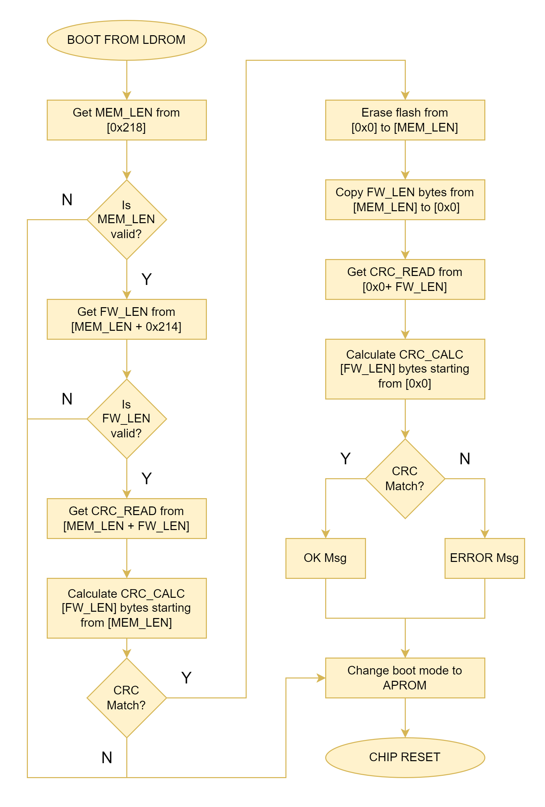

# bootm03x

Bootloader for Nuvoton M03x microcontrollers (M031 and M032).

* [Nuvoton M031 Series BSP](https://github.com/OpenNuvoton/M031BSP/)

* [NuEclipse IDE](https://www.nuvoton.com/tool-and-software/ide-and-compiler/)

* [NuLink Command Tool](https://www.nuvoton.com/resource-download.jsp?tp_GUID=SW1720200221181644) 

## Usage

The Nuvoton M031/032 MCU has can boot either from ``APROM`` (address ``0x0``) or ``LDROM`` (address ``0x100000``).

This bootloader is intended to be used with an application that normally boots from ``APROM``.

For bootloader operation , the ``APROM`` memory is splitted in two parts of equal length (``MEM_LEN``, which is half of total ``APROM`` size). The first part is the *main region*, from which the main program runs. The second part is the *transfer region*, used only for keeping the new firmware data during boot loading.

| Flash size  | ``MEM_LEN`` |
| ----------- | ----------- |
| 16K         | 0x2000      |
| 32K         | 0x4000      |
| 64K         | 0x8000      |
| 128K        | 0x10000     |
| 256K        | 0x20000     |
| 512K        | 0x40000     |

The ``MEM_LEN`` must be stored in the ``APROM`` *main region* ``0x218`` fixed address, so the bootloader can know where to erase and fro where to copy data.

The resulting binary from this program need to be flashed at the ``LDROM`` address (``0x100000``). Flashing can be done with the following command lines:

1. Convert ``Intel HEX`` files to binary using ``hex2bin``:
	``` sh 
	hex2bin -e bin bootm03x.hex
	hex2bin -e bin application.hex
	```
2. Erase flash:
    ``` sh
    NuLink -e all
    ```
3. Write firmware binaries in the specific regions:
    ``` sh
    NuLink -w APROM application.bin
    NuLink -w LDROM bootm03x.bin
    ```
4. Write ``CONFIG`` data to set default boot from ``APROM``:   
    ``` sh
    NuLink -w CFG0 0xFFFFFFBF
    NuLink -w CFG1 0xFFFFFFFF
    NuLink -w CFG2 0xFFFFFF5A
    NuLink -w CFG3 0xFFFFFFFF
    ```
5. Reset the MCU
    ``` sh
    NuLink -reset
    ```
    
## Operation

* MCU boots from ``APROM`` by default, and the application keeps running;
* Application receives *new firmware data* and stores it at the *transfer region* starting from address ``MEM_LEN``;
* Application gets the *new firmware data* **length**. This value is stored at the fixed address ``FW_LEN = MEM_LEN + 0x214``;
* Application checks the *new firmware data* **integrity** (CRC32 calculation of ``FW_LEN`` starting from ``MEM_LEN`` address);
* Application sets the default boot to ``LDROM``;
* Bootloader runs and performs as described in the following flowchart:




## Changelog

### v2.0
* Initial version.
